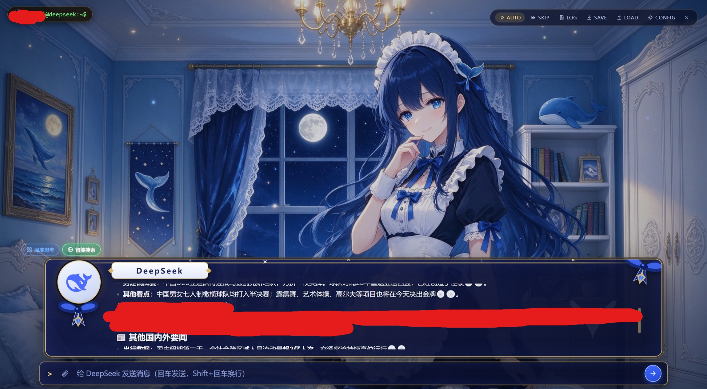
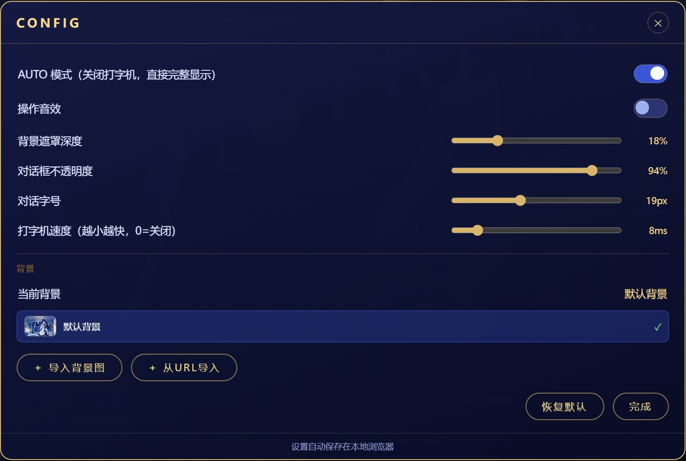

# 🎮 DeepSeek Gal View

> 将 DeepSeek 网页版聊天界面美化成 **Galgame / 恋爱游戏风格** 的用户脚本（Tampermonkey / 油猴）。
> 深夜卧室氛围、鲸鱼娘、华丽对话框、打字机效果 —— 让每一次对话都像在玩游戏。

---

## 🖼️ 界面预览

### 聊天界面

### Config 配置界面

---

## ✨ 功能特性

- **Galgame 恋爱风格界面**：夜卧背景、蓝发鲸鱼娘、华丽渐变对话框、星空点缀、水印
- **打字机效果**：可调节速度 / 关闭
- **Markdown 渲染增强**：白色文字、紧凑行距、白色加粗表格边框、代码块排版优化
- **代码块操作**：一键复制（带 ✓ 反馈）、按语言下载
- **附件上传**：三色详情（文件名 / 类型 / 大小）、左对齐、可删除
- **深度思考 / 智能搜索开关**：与附件并列，原生风格图标，实时切换原生模式
- **背景系统**：内置默认背景 + 本地图片导入 + URL 导入（可存浏览器 / 仅引用），多背景选择、小图预览，IndexedDB 持久化
- **完整菜单**：AUTO / SKIP / LOG / SAVE / LOAD / CONFIG / 退出
- **原生 DeepSeek logo 徽章**：与官方页面完全一致的鲸鱼图标

## 🔧 配置项（CONFIG）

| 项 | 说明 |
|---|---|
| AUTO 模式 | 关闭打字机，直接完整显示 |
| 操作音效 | 开关 |
| 背景遮罩深度 | 0–70% |
| 对话框不透明度 | 60–100% |
| 对话字号 | 15–25px |
| 打字机速度 | 0–60ms（越小越快） |
| 背景 | 默认 / 导入 / URL，多图切换 |

## 📦 安装

1. 浏览器安装 [Tampermonkey](https://www.tampermonkey.net/) 扩展
2. 导入脚本文件 `deepseek-gal-view-1.1.user.js`
3. 打开 `https://chat.deepseek.com` 即可

## 🎯 使用

- 点击右上角 **✦ Gal View** 进入 Gal 界面
- 点击 **CONFIG** 打开设置面板，背景等选项均在面板内操作
- 所有设置自动保存在本地浏览器

## 🛠️ 技术要点

- 背景图存储于 **IndexedDB**，选择记录于 **localStorage**，刷新 / 重启均保留
- 正文 Markdown 复用原生 `.ds-markdown` 渲染，保证效果与原生一致
- 附件上传 / 开关切换均通过程序化触发原生控件实现

## 📄 许可

仅供个人学习与娱乐使用。

---

*版本 1.1.0*
